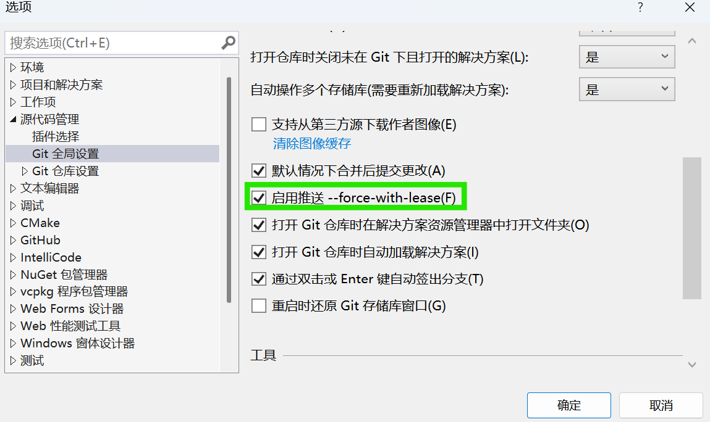

+++
date = '2026-09-24T08:07:25+08:00'
title = 'Git 团队协作'
description = '（之前给小组作业队友写的简单教程......'
weight = 0
categories = ['Guide']
tags = ['Git']
+++

## 初始化

从远程克隆仓库

```sh
git clone https://github.com/<username>/<repository-name>.git
cd <repository-name>
```

在该文件夹中安装 pre-commit 钩子

```sh
pre-commit install
```

创建自己的分支并将其推送到远程

```sh
git checkout -b <Your-Branch-Name>
git push origin <Your-Branch-Name>
```

请在自己的分支上进行开发，不要将任何修改直接推送到`main`分支（当然可以随时把在自己分支上的 commit 推送到远程）

## commit message 规范

conventional commits，可参考：

[https://www.conventionalcommits.org/zh-hans](https://www.conventionalcommits.org/zh-hans)

```plain
type(scope): subject
```

1.type（必须）: commit 的类别，只允许使用下面几个标识：

| **Type**     | **Description**                  |
| ------------ | -------------------------------- |
| **feat**     | 新功能                           |
| **fix**      | 修复bug                          |
| **build**    | 修改项目构建系统                 |
| **chore**    | 杂项，修改工具配置等非业务性代码 |
| **ci**       | 修改持续集成流程                 |
| **docs**     | 修改文档                         |
| **style**    | 仅代码样式修改                   |
| **refactor** | 重构代码                         |
| **perf**     | 优化性能                         |
| **test**     | 修改测试用例                     |

2.scope（可选）: 用于说明 commit 影响的范围，比如数据层、控制层、视图层等等，视项目不同而不同

3.subject（必须）: commit 的简短描述

## 从远程`main`分支更新本地自身分支

即下一项的前两步

```sh
git fetch origin main
git rebase origin/main
```

## PR 流程/将内容合并到`main`分支

（均可在 VS/VSCode 图形界面上做相应操作）

在自己的分支上完成一个/一些功能之后：

- 从远程拉取最新的`main`分支：

```sh
git fetch origin main
```

> 注意这条命令只是拉取远程 main 分支信息，不会更新本地 main 分支（不影响后面操作）
> 如果要更新本地 main 分支：
> git checkout main
> git pull origin main
> git checkout -
> 即 切换到 main 分支 - 将远程 main 与本地 main 合并 - 切回

- 将远程`main`分支的变更合并（变基）到当前分支：

```sh
git rebase origin/main
```

> 如果提示合并冲突，打开代码编辑器手动解决  
> 解决完成之后输入
> git rebase --continue



- 将自己的分支的最新状态推送到远程（要加 -f 强制推送，因为变基导致本地提交历史与远程不一致；vs可以在设置中勾选如图所示的选项，然后在提示推送失败时选择强制推送）

```sh
git push -f
```

- 在 github 网页上创建一个 Pull Request，将自己的分支合并到`main`分支，等待组长审核

## VS 中部分图形界面翻译解释

提取：fetch，从远程获取当前分支的最新信息

拉取：pull，pull 即 fetch + merge，从远程获取当前分支的最新信息并合并到本地的当前分支

推送：push，把本地当前分支推送到远程

同步：pull + push

合并：merge，将某分支的变更合并到当前分支

签出：checkout，切换分支

变基：rebase，以“将当前分支的提交历史变更为在某分支的最新提交的基础上进行的修改”这一方式进行的合并，相比merge的合并，提交记录看起来更干净
