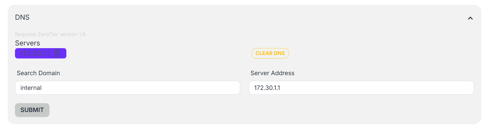
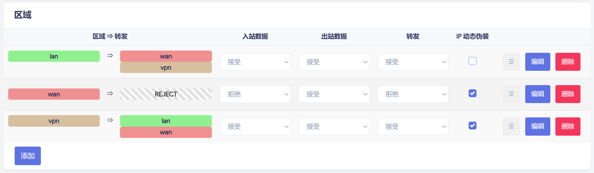
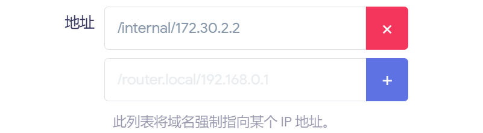
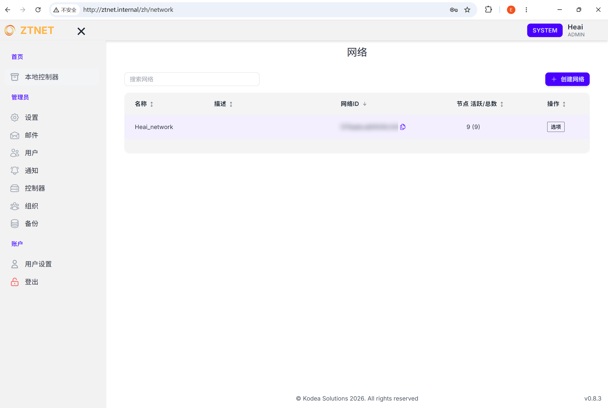

+++
date = '2026-09-20T10:01:51+08:00'
title = 'ztnet 内网 DNS 服务搭建'
categories = ['Network']
tags = ['ZeroTier', 'Nginx', 'DNS']
+++

## 背景

### ZeroTier 网络结构

使用网段 `172.30.0.0/22`

| 设备        | IP           | 备注                      |
| ----------- | ------------ | ------------------------- |
| 家宽路由器  | `172.30.1.1` | OpenWRT，动态公网 IP      |
| 台式机      | `172.30.1.2` | Windows                   |
| 笔记本      | `172.30.1.3` | Windows                   |
| 手机        | `172.30.1.4` | Android                   |
| 云服务器1   | `172.30.2.1` | Debian，固定公网 IP       |
| 物理服务器1 | `172.30.2.2` | Debian，位于路由器下子网  |
| 物理服务器2 | `172.30.2.3` | Debian，位于路由器下子网  |
| 云服务器2   | `172.30.3.1` | Debian，海外，固定公网 IP |
| 云服务器3   | `172.30.3.2` | Debian，海外，固定公网 IP |

由于 ZeroTier Moon 自定义中继节点需要固定公网 IP，因此将云服务器1配置为 Moon 节点，同时在其上部署了自建控制器 ztnet

### 需求

各服务器上的各端口部署了多种 Web 服务，如 ztnet 控制器监听 `172.30.2.1:3000`、`172.30.2.3:3000` 部署了 New API、`172.30.2.3:12345` 部署了一个 HTTP 语音合成 API 服务等，各 IP、端口不便记忆，在各个设备上配置 hosts 文件也不便利

ZeroTier 提供了一个将特定 Search Domain 后缀的 DNS 请求转发到指定 DNS 服务器的功能，因此可集中式地管理配置一个内网 DNS 服务，再由一个集中的 Nginx 反向代理根据不同的域名转发到不同的 IP:端口

> 本人网络中主要的数据交互集中于家宽子网下的两台物理服务器，因此选择使用一个集中的 Nginx 反代服务以方便配置；对于这一绕行延迟不可接受的场景，可考虑在 dnsmasq 做域名的具体解析，并在各节点分别部署反代

## 配置

### 控制器

使用 .internal 后缀作为内网 DNS 所用域名[^1]，指定将它的 DNS 请求转发到 `172.30.1.1`



### DNS 服务（路由器）

路由器本身自带 dnsmasq 服务，因此只需让来自 ZeroTier 网络的 DNS 请求能被它接收即可

配置防火墙，允许接受来自 vpn 接口的 ZeroTier 网络流量



使用 dnsmasq 的泛域名解析功能，将 .internal 后缀的域名均解析到 `172.30.2.2`（Nginx 反代服务的部署位置）



> 对于非 http 服务，不适合使用 Nginx 反代，可在路由器上直接配置 dnsmasq 的 域名-IP 解析映射

### 各设备

ZeroTier 客户端出于安全原因默认不接受控制器下发的 DNS，需要在各设备上手动操作允许

```sh
zerotier-cli set <NetworkID> allowDNS=1
```

### Nginx 反代

创建新 Nginx 配置文件 `/etc/nginx/sites-available/proxy`，部分内容如下，`proxy_params` 为默认反向代理参数配置文件，位于 `/etc/nginx/proxy_params`

```Nginx
server {
    listen 80;
    server_name ztnet.internal;

    location / {
        proxy_pass http://172.30.2.1:3000;
        include proxy_params;
    }
}

server {
    listen 80;
    server_name llmapi.internal;

    location / {
        proxy_pass http://172.30.2.3:3000;
        include proxy_params;
    }
}

server {
    listen 80 default_server;
    server_name _;
    return 444;
}
```

将配置文件软链接到 `/etc/nginx/sites-enabled/proxy`，并重载 Nginx 服务

```sh
ln -s /etc/nginx/sites-available/proxy /etc/nginx/sites-enabled/proxy
systemctl reload nginx
```

## 测试及问题

1. 访问任何域名均返回 503 Service Unavailable，Nginx 日志无内容，发现为 .internal 域名默认被本地代理软件代理，需手动配置路由 internal -> direct
2. `ztnet.internal` 访问正常但无法登录，因其使用的 NextAuth 框架有严格的域名限制，需在其 docker-compose.yml 配置中将 NEXTAUTH_URL 字段修改为 `http://ztnet.internal`，并重启 ztnet 容器
3. 在 Linux 设备上，ZeroTier 客户端不会自动注入 DNS，需要手动配置（而本人网络中两台 Linux 物理服务器恰好位于路由器子网中，本身就使用它的 DNS，无需配置也可正常访问）

```sh
resolvectl dns <ZeroTier 虚拟网卡名> 172.30.1.1
resolvectl domain <ZeroTier 虚拟网卡名> "~internal"
```



[^1]: <https://www.icann.org/en/board-activities-and-meetings/materials/approved-resolutions-special-meeting-of-the-icann-board-29-07-2024-en#section2.a>
